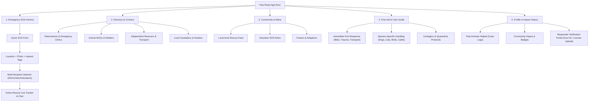

# Paw ResQ: Information Architecture & Taxonomy Specification

## 1. Overview & Navigation Philosophy
**Paw ResQ** operates on a **Dual-State Information Architecture**:
1. **Emergency Mode (High Urgency, Low Friction):** Activated during active SOS reporting. Hides extraneous content, prioritizes location tagging, multi-broadcast recipient selection, hazard tagging, and live status tracking.
2. **Community & Care Mode (Standard Navigation):** Active during normal browsing. Provides access to directory searches, community forums, caretaker onboarding, medical guidance, and rescue history logs.

---

## 2. Global Sitemap Architecture



---

## 3. Primary Navigation Bar Schema (Bottom Nav)

| Tab Icon | Tab Name | Primary Purpose | Key Components |
| :--- | :--- | :--- | :--- |
| 🚨 **Red/Amber SOS Pulse** | **Emergency SOS** | Immediate rescue initiation | 1-Tap SOS Button, Camera Capture, Multi-Select Broadcast, Active Case Tracker |
| 🔍 **Directory** | **Connect & Care** | Browse verified help contacts | Filter by distance, ratings, open hours, specialty (Vet/NGO/Volunteer) |
| 🔔 **Alerts** | **Community** | Local rescue network feed | Geo-targeted SOS alerts for volunteers, foster requests, adoption posts |
| 📚 **Guides** | **First-Aid Guide** | Immediate offline-capable medical tips | Handling instructions, bite safety, CPR, quarantine advice |
| 👤 **Profile** | **My Impact** | History & credentials | Past cases helped, recovery photos, verification status badge |

---

## 4. Screen-by-Screen Content Inventory & Data Taxonomy

### Screen 1.1: SOS Report Creator (High Priority)
* **Input Fields:**
  - `Geo_Location` (Auto-GPS + Manual Drag Pin)
  - `Animal_Type` (Dog, Cat, Bird, Cattle, Wildlife, Other)
  - `Condition_Severity` (Critical/Bleeding, Fractured/Immobile, Sick/Infectious, Abandoned/Trapped)
  - `Photo_Upload` (Single/Multiple Photo/Video capture)
  - `Hazard_Flags` [Checkboxes]: `Infection Risk`, `Panicked/Biting Risk`, `Hard to Access Location`
  - `Recipient_Selection` [Multi-Checkboxes]: `Local Volunteers (2km)`, `Animal NGOs`, `Emergency Vets`, `Rescue Transport`
* **CTAs:** `[ DISPATCH SOS BROADCAST ]` (Primary Warm Accent Button)

### Screen 1.2: Active Rescue Live Tracking & Handoff
* **Data Displayed:**
  - Live Map showing Responder location relative to Bystander
  - Accepted Responder Profile Card (Name, Verified Badge, Rating, Phone/Chat)
  - Status Timeline: `Broadcast Sent` ➔ `Accepted` ➔ `Responder En Route` ➔ `Arrived on Site` ➔ `Handoff Complete`
* **CTAs:** `[ Call Responder ]`, `[ In-App Chat ]`, `[ Confirm Handoff & Departure ]`

---

## 5. Taxonomy & Tagging Hierarchy
To ensure fast searching and filtering across the platform, Paw ResQ uses a unified taxonomy:

```
Animal Condition
├── Emergency / Critical (Requires Medical Vet / Ambulance)
├── Non-Emergency Injury (Requires Local Volunteer / Caretaker)
├── Abandoned / Foster Need (Requires Shelter / NGO)
└── Contagious / Infection Risk (Requires Quarantine Protocol)

Responder Verification Tiers
├── Tier 0: General Bystander (Unverified)
├── Tier 1: Verified Volunteer (Aadhaar / Govt ID Verified)
├── Tier 2: Verified NGO / Shelter (Registration Document Verified)
└── Tier 3: Licensed Veterinarian / Clinic (Medical License Verified)
```
