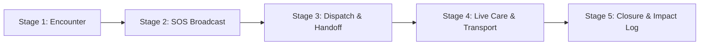

# Paw ResQ: End-to-End User Journey Map

## Overview
This journey map outlines the emotional, cognitive, and functional steps a bystander takes when utilizing **Paw ResQ** to save an animal in distress. It ensures seamless handoffs between the **Bystander (Report Creator)** and the **Responder (Volunteer/NGO/Vet)**.

---

## 5-Stage Journey Lifecycle

---

## Detailed Journey Breakdown

### Stage 1: Encounter & Realization
* **User Context:** A citizen (e.g., student or working professional) encounters an injured, sick, or trapped animal while commuting or walking.
* **Emotional State:** Panic, anxiety, guilt ("I can't just leave it here, but I don't know what to do").
* **User Goal:** Quickly assess if the animal needs emergency intervention.
* **Paw ResQ UX Response:**
  - One-tap "Report Emergency" access on home screen (no complex login screens during SOS mode).
  - Quick-glance first-aid & safety cards (e.g., "Do not touch if rabid symptoms present", "Keep distance, take photo").

---

### Stage 2: SOS Creation & Multi-Select Dispatch
* **User Context:** User captures a photo, confirms geo-location, tags severity, and selects recipients.
* **Emotional State:** Urgency, need for validation ("Will someone actually come?").
* **User Goal:** Send a comprehensive broadcast to nearby caretakers, NGOs, and volunteers in under 30 seconds.
* **Paw ResQ UX Response:**
  - **Auto Location Tagging:** GPS pin drops automatically with manual override.
  - **Multi-Select Dispatch:** Checkboxes for `Volunteers (0.5km - 3km)`, `NGO Rescuers`, `Emergency Vets`.
  - **Hazard / Symptom Tags:** Checkboxes for `Bleeding`, `Fracture/Mobility Loss`, `Infectious Symptoms`, `Aggressive/Panicked`.
  - **Instant Reassurance:** "SOS Broadcast sent to 12 nearby registered helpers."

---

### Stage 3: Dispatch & Handoff (Physical Connection)
* **User Context:** A nearby volunteer or NGO accepts the ping. The bystander receives live status updates.
* **Emotional State:** Relief transitioning to anticipation.
* **User Goal:** Coordinate physical arrival without confusion or missed locations.
* **Paw ResQ UX Response:**
  - **Live Responder ETA & Map Tracking:** View accepted responder's progress on an interactive map.
  - **In-App Direct Call / Secure Chat Box:** Direct channel between Bystander and Responder.
  - **Arrival Handoff Protocol:** Digital confirmation when responder arrives at the scene ("Responder on site. Confirm handoff"). Bystander can choose to remain or depart safely.

---

### Stage 4: Live Care & Transport
* **User Context:** Rescuer stabilizes or transports the animal to a partner vet clinic or shelter.
* **Emotional State:** Hopeful, invested in the outcome.
* **User Goal:** Ensure the animal reaches medical care safely.
* **Paw ResQ UX Response:**
  - **Transit Status:** Case state shifts from `In Transit` to `Admitted at Clinic/Shelter`.
  - **Case Tracking ID:** A dedicated case reference auto-saved to user's profile.

---

### Stage 5: Closure & Post-Rescue Impact Log
* **User Context:** Hours/days after the incident, the shelter or responder updates the animal's recovery status.
* **Emotional State:** Fulfillment, pride, deep emotional closure.
* **User Goal:** Know that their action saved a life.
* **Paw ResQ UX Response:**
  - **Recovery Push Notification:** Photo update from shelter ("Tommy is recovering well!").
  - **History & Impact Profile:** Entry added to the user's `Past Animals Helped` timeline.
  - **Community Impact Badge:** Unlocks digital recognition ("Life Saver Level 1").

---

## Summary Matrix

| Stage | Key Touchpoint | Primary User Emotion | Critical Design Requirement |
| :--- | :--- | :--- | :--- |
| **1. Encounter** | Home Screen SOS Button | Panic & Confusion | 0-friction access, high contrast emergency CTA |
| **2. SOS Broadcast** | Report Form & Tagging | Urgency | Multi-select dispatch, auto-GPS, hazard tags |
| **3. Handoff** | Responder Map & Chat | Relief & Anticipation | Live ETA, phone/chat bridge, handoff confirmation |
| **4. Live Care** | Case Status Tracker | Hopeful Investment | Transparent status updates (In Transit / Admitted) |
| **5. Closure** | History & Impact Log | Pride & Fulfillment | Recovery photo updates, lifetime impact counter |
