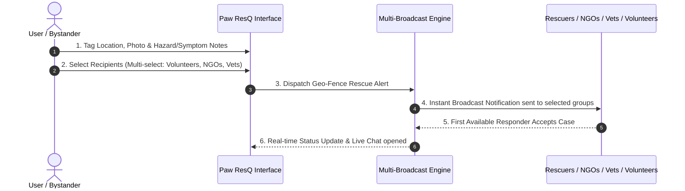

# UX Research & Foundations: Paw ResQ

## 1. Project Overview & Concept
**App Name:** **Paw ResQ**  
**Brand Vibe:** Emergency-focused, warm, caring, soft-toned, community-driven  

**App Vision:** A location-based animal-care emergency & support platform designed to empower everyday citizens to take immediate, effective action when encountering injured, abandoned, sick, trapped, or vulnerable animals.

**Core Value Proposition:** Bridging the critical gap between compassionate bystanders and qualified care providers (Veterinarians, Animal NGOs, Rescuers, Shelters, and Local Caretakers) through real-time, location-aware matchmaking and actionable guidance.

---

## 2. High-Stress Empathy Map (User Psychological State)

| Dimension | Bystander Experience & Mindset | Design & UX Implication in Paw ResQ |
| :--- | :--- | :--- |
| **Pains & Fears** | • **Fatal Guilt:** Fear that the animal will die right in front of them.<br>• **Contagion Anxiety:** Fear of transmissible infections/diseases to themselves or other animals. | • **Immediate Calm Assurance:** Display clear, step-by-step emergency handling tips right after report creation.<br>• **Symptom & Hazard Tags:** Allow users to tag "Infectious symptoms suspected" to alert rescuers with proper quarantine gear. |
| **Needs & Desires** | • **Rapid Connection:** Reaching help immediately without dialing multiple dead numbers.<br>• **Community Support:** Knowing they are not alone in handling the emergency. | • **Multi-Select Dispatch:** Single-click alert to multiple entity types at once.<br>• **Warm Tone:** Microcopy that praises and reassures the user ("You've initiated help. Rescue network notified!"). |
| **Brand Tone** | • **Warm, Care-Oriented, Soft:** Empathetic, supportive, accessible (avoiding cold clinical or aggressive interfaces). | • Soft color palette (gentle greens, warm ambers, soothing whites), humanized status indicators, and community encouragement. |

---

## 3. Precedent & Gap Audit: Informal Channels vs. Paw ResQ

| Current Informal Channel (Verbal / Word-of-Mouth) | Failure Points & Delays in Emergencies | Paw ResQ Solution |
| :--- | :--- | :--- |
| **Hyper-Local Word of Mouth:** Asking nearby shopkeepers or residents who feeds/takes care of local animals. | • **Single Point of Failure:** If the specific caretaker is unavailable or out of the area, rescue halts completely.<br>• **Time Lag:** Physical searching and asking around burns critical golden-hour medical time. | • **Geo-Fenced Broadcast:** Instantly alerts *all* registered caretakers, volunteers, and NGOs within a 3-5km radius simultaneously. |
| **Random Phone Calls:** Trying to find vet numbers or NGO contacts online. | • **Outdated Contact Info:** Lines unanswered, NGOs closed, or vets off-duty.<br>• **Panic-Induced Inaction:** User gives up due to friction. | • **Verified Status & Multi-Select:** Only active/available responders receive the ping; user pings multiple groups at once. |

---

## 4. Service Blueprint & Multi-Broadcast Dispatch System

### Dispatch Flow (Front-Stage to Back-Stage Handoff)



### Trust & Verification Hierarchy

```
[ Unverified Account ]
       │
       ▼ (Submits ID / License / NGO Reg Document)
[ Verification Review ]
       │
       ▼ (Passes Admin Audit)
[ Verified Responder Badge ] ──► (Builds Community Trust via Post-Rescue User Reviews & Ratings)
```

1. **Onboarding Document Verification:**
   - **NGOs:** Registration Certificate / Official License.
   - **Veterinarians:** Medical Council License / Clinic Registration.
   - **Volunteers / Rescuers:** Government ID verification (Aadhaar/Govt ID) + Phone Verification.
2. **Community Feedback Loop:**
   - Post-intervention user reviews and trust ratings to maintain active, reliable rescue network quality.
