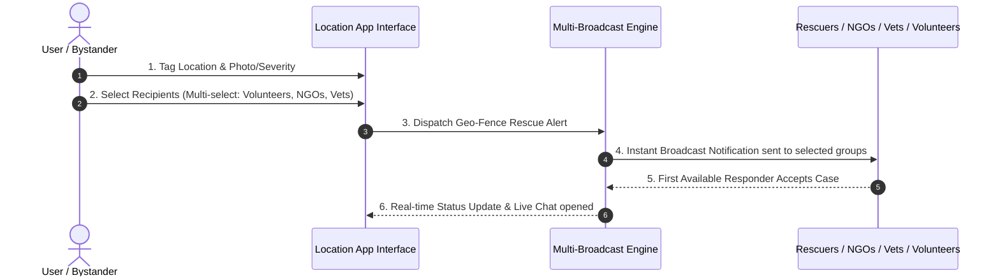

# UX Research & Foundations

## 1. Project Overview & Concept
**App Vision:** A location-based animal-care emergency & support platform designed to empower everyday citizens to take immediate, effective action when encountering injured, abandoned, sick, trapped, or vulnerable animals.

**Core Value Proposition:** Bridging the critical gap between compassionate bystanders and qualified care providers (Veterinarians, Animal NGOs, Rescuers, Shelters, and Local Caretakers) through real-time, location-aware matchmaking and actionable guidance.

---

## 2. High-Stress Empathy Map (User Psychological State)

| Dimension | Bystander Experience & Mindset | Design & UX Implication |
| :--- | :--- | :--- |
| **Pains & Fears** | • **Fatal Guilt:** Fear that the animal will die right in front of them.<br>• **Contagion Anxiety:** Fear of transmissible infections/diseases to themselves or other animals.<br>• **Helplessness:** Not knowing basic safe handling or medical first-response steps. | • **Immediate Calm Assurance:** Display clear, step-by-step emergency handling tips right after report creation.<br>• **Symptom & Hazard Tags:** Allow users to tag "Infectious symptoms suspected" to alert rescuers with proper quarantine gear. |
| **Needs & Desires** | • **Rapid Connection:** Reaching help immediately without dialing multiple dead numbers.<br>• **Community Support:** Knowing they are not alone in handling the emergency. | • **Multi-Select Dispatch:** Single-click alert to multiple entity types at once.<br>• **Warm Tone:** Microcopy that praises and reassures the user ("You've initiated help. Rescue network notified!"). |
| **Brand Tone** | • **Warm & Community-Driven:** Empathetic, supportive, accessible (avoiding overly sterile or cold clinical interfaces). | • Soft, warm color palette, humanized status indicators, and community encouragement badges. |

---

## 3. Service Blueprint & Multi-Broadcast Dispatch System

### Dispatch Flow (Front-Stage to Back-Stage Handoff)



### Trust & Verification Hierarchy

```
[ Unverified Account ]
       │
       ▼ (Submits ID / License / NGO Reg Document)
[ Verification Review ]
       │
       ▼ (Passes Admin Audit)
[ Verified Responder Badge ] ──► (Builds Community Trust via Post-Rescue User Reviews & Ratings)
```

1. **Onboarding Document Verification:**
   - **NGOs:** Registration Certificate / Official License.
   - **Veterinarians:** Medical Council License / Clinic Registration.
   - **Volunteers / Rescuers:** Government ID verification (Aadhaar/Govt ID) + Phone Verification.
2. **Community Feedback Loop:**
   - Post-intervention user reviews and trust ratings to maintain active, reliable rescue network quality.

---

## 4. Precedent & Trust Audit (In Progress)

To complete **Phase 1: Narrative & Objectives**, we need to finalize the competitive positioning and brand identity:

1. **Local Precedents:** What current informal channels do rescuers in your area use (e.g., WhatsApp SOS groups, Instagram stories, Facebook community pages)? What works well, and what fails in those channels?
2. **App Naming & Brand Identity:** Do you have a working title or aesthetic keyword in mind for this app (e.g., *Pawsignal, ResQ, StrayCare, Aasra, Companion*)?
