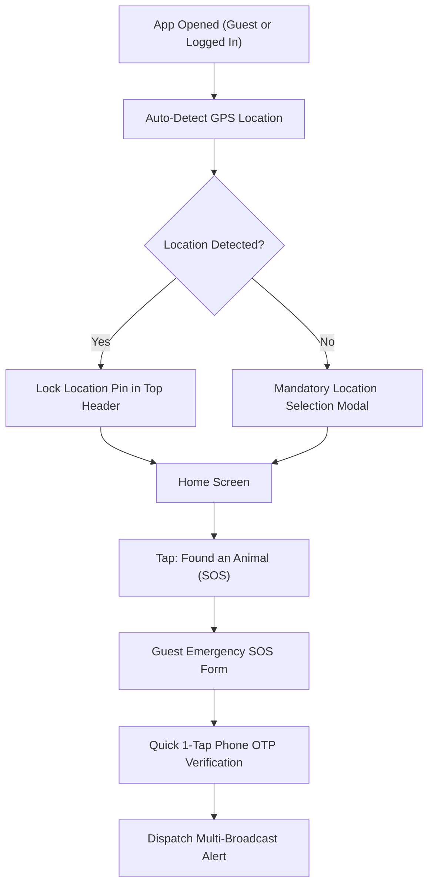

# Paw ResQ: Low-Fidelity Wireframes & User Flows (Phase 4)

## 1. Overview
This document specifies the structural wireframes, layout logic, and user flows for **Paw ResQ**, incorporating the mandatory location-first architecture, dual user perspectives (Bystander vs. Helper), Guest SOS emergency flow, clean bottom navigation bar, and detailed step-by-step page designs.

---

## 2. Non-Skippable Location & Guest SOS Flow


---

## 3. Clean Bottom Navigation Bar Schema

```
+-----------------------------------------------------------------------+
|  [ 🏠 Home ]    [ 🔍 Search ]    [ 🚨 Quick SOS ]    [ 💬 Chat ]    [ 👤 Profile ]  |
+-----------------------------------------------------------------------+
```

---

## 4. Home Screen Interface: Dual Perspective Layouts

### Perspective A: The Reporter / Bystander (Finding an Animal)

```
+-------------------------------------------------------------+
| [Profile / Sign In]   📍 Hitech City, Hyd   [🔔]  [🗺️ Map]  |
+-------------------------------------------------------------+
|                                                             |
|   +-----------------------------------------------------+   |
|   | 🚨 FOUND AN INJURED ANIMAL (HERO SOS CARD)          |   |
|   |    Tap for Immediate Location-Based Help            |   |
|   +-----------------------------------------------------+   |
|                                                             |
|   +--------------------------+  +-----------------------+   |
|   | 🛟 ACTIVE RESCUES        |  | 🩺 NEARBY VETS        |   |
|   |    Track ongoing cases   |  |    Emergency clinics  |   |
|   +--------------------------+  +-----------------------+   |
|                                                             |
|   +-----------------------------------------------------+   |
|   | 💡 First-Aid Card: Keep animal warm & quiet          |   |
|   +-----------------------------------------------------+   |
|                                                             |
+-------------------------------------------------------------+
| [🏠 Home]   [🔍 Search]   [🚨 SOS]   [💬 Chat]   [👤 Profile]|
+-------------------------------------------------------------+
```

### Perspective B: The Helper / Responder (Volunteer, NGO, Vet)

```
+-------------------------------------------------------------+
| [Verified Helper ID]  🟢 Status: On-Duty   [🔔 (3)] [🗺️ Map] |
+-------------------------------------------------------------+
|                                                             |
|   +-----------------------------------------------------+   |
|   | ⚡ 3 OPEN RESCUE PINGS WITHIN 3 KM                   |   |
|   |    Tap to view details and accept emergency         |   |
|   +-----------------------------------------------------+   |
|                                                             |
|   +--------------------------+  +-----------------------+   |
|   | 📋 MY ASSIGNED CASES     |  | 🚑 TRANSPORT STATUS   |   |
|   |    2 Active Handoffs     |  |    Ambulance Ready    |   |
|   +--------------------------+  +-----------------------+   |
|                                                             |
+-------------------------------------------------------------+
| [🏠 Home]   [🔍 Search]   [🚨 SOS]   [💬 Chat]   [👤 Profile]|
+-------------------------------------------------------------+
```

---

## 5. Page 2: Emergency SOS Flow (Bystander vs. Helper Dual Perspective)

### Bystander Creation Flow (Strict Priority Order)

```
[ Step 2.1: LOCATION (MANDATORY) ]
  • Auto GPS pin lock + Landmark note. Cannot skip.
            │
            ▼
[ Step 2.2: CONDITION & HAZARD TAGS (MANDATORY) ]
  • Species (Dog/Cat/Bird/Cattle)
  • Severity (Bleeding/Fracture/Sick/Trapped)
  • Hazard Flags (Biting Risk / Infection Risk). Cannot skip.
            │
            ▼
[ Step 2.3: RECIPIENT SELECTOR (MANDATORY) ]
  • Multi-select (Volunteers, NGOs, Vets, Transport). Cannot skip.
            │
            ▼
[ Step 2.4: PHOTO UPLOAD (OPTIONAL / SECONDARY) ]
  • Upload Photo/Video OR tap [ SKIP & DISPATCH INSTANTLY ]
  • Can add photos later while waiting for helper to accept.
            │
            ▼
[ 🚨 INSTANT EMERGENCY DISPATCH ]
```

---

### Helper Response Flow (Simultaneous Action)
```
[ Bystander Dispatches SOS ]
            │
            ▼ (Geo-fenced broadcast to On-Duty Helpers within 3 km)
[ Screen 2.1H: High-Priority Push Notification & Lock Screen Sound ]
            │
            ▼
[ Screen 2.2H: Rescue Alert Card Modal ]
├── Distance: 1.2 km (4 mins away)
├── Animal: Injured Dog (Bleeding / Critical)
├── Hazard Warning: ⚠️ Biting Risk / High Traffic Area
├── Photo: [ Photo Attached OR "Photo Pending from Bystander" ]
├── Bystander: Priyanka S. (Verified Bystander)
└── Actions: [ ✋ ACCEPT RESCUE ]  [ 💬 Chat ]  [ ⏩ Pass ]
            │
            ▼ (Helper taps Accept)
[ Screen 2.3H: Active Navigation & On-Site Handoff Console ]
├── Live GPS Turn-by-Turn Navigation to Animal Location
├── Direct Phone / Chat bridge to Bystander
└── Action Buttons: [ I Have Arrived ] [ Request Ambulance ] [ Complete Handoff ]
```
