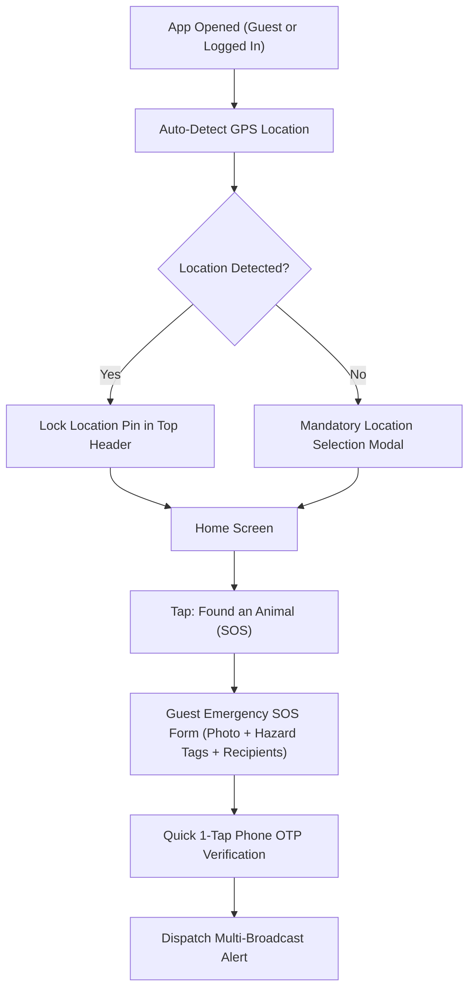

# Paw ResQ: Low-Fidelity Wireframes & User Flows (Phase 4)

## 1. Overview
This document specifies the structural wireframes, layout logic, and user flows for **Paw ResQ**, incorporating the mandatory location-first architecture, dual user perspectives (Bystander vs. Helper), Guest SOS emergency flow, and clean bottom navigation bar.

---

## 2. Non-Skippable Location & Guest SOS Flow


---

## 3. Clean Bottom Navigation Bar Schema

```
+-----------------------------------------------------------------------+
|  [ 🏠 Home ]    [ 🔍 Search ]    [ 🚨 Quick SOS ]    [ 💬 Chat ]    [ 👤 Profile ]  |
+-----------------------------------------------------------------------+
```

---

## 4. Home Screen Interface: Dual Perspective Layouts

### Perspective A: The Reporter / Bystander (Finding an Animal)

```
+-------------------------------------------------------------+
| [Profile / Sign In]   📍 Hitech City, Hyd   [🔔]  [🗺️ Map]  |
+-------------------------------------------------------------+
|                                                             |
|   +-----------------------------------------------------+   |
|   | 🚨 FOUND AN INJURED ANIMAL (HERO SOS CARD)          |   |
|   |    Tap for Immediate Location-Based Help            |   |
|   +-----------------------------------------------------+   |
|                                                             |
|   +--------------------------+  +-----------------------+   |
|   | 🛟 ACTIVE RESCUES        |  | 🩺 NEARBY VETS        |   |
|   |    Track ongoing cases   |  |    Emergency clinics  |   |
|   +--------------------------+  +-----------------------+   |
|                                                             |
|   +-----------------------------------------------------+   |
|   | 💡 First-Aid Card: Keep animal warm & quiet          |   |
|   +-----------------------------------------------------+   |
|                                                             |
+-------------------------------------------------------------+
| [🏠 Home]   [🔍 Search]   [🚨 SOS]   [💬 Chat]   [👤 Profile]|
+-------------------------------------------------------------+
```

---

### Perspective B: The Helper / Responder (Volunteer, NGO, Vet)

```
+-------------------------------------------------------------+
| [Verified Helper ID]  🟢 Status: On-Duty   [🔔 (3)] [🗺️ Map] |
+-------------------------------------------------------------+
|                                                             |
|   +-----------------------------------------------------+   |
|   | ⚡ 3 OPEN RESCUE PINGS WITHIN 3 KM                   |   |
|   |    Tap to view details and accept emergency         |   |
|   +-----------------------------------------------------+   |
|                                                             |
|   +--------------------------+  +-----------------------+   |
|   | 📋 MY ASSIGNED CASES     |  | 🚑 TRANSPORT STATUS   |   |
|   |    2 Active Handoffs     |  |    Ambulance Ready    |   |
|   +--------------------------+  +-----------------------+   |
|                                                             |
+-------------------------------------------------------------+
| [🏠 Home]   [🔍 Search]   [🚨 SOS]   [💬 Chat]   [👤 Profile]|
+-------------------------------------------------------------+
```
