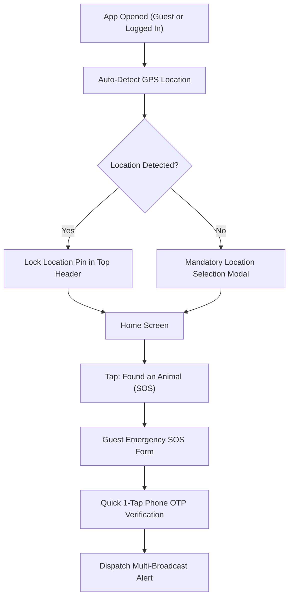

# Paw ResQ: Low-Fidelity Wireframes & User Flows (Phase 4)

## 1. Overview
This document specifies the structural wireframes, layout logic, and user flows for **Paw ResQ**, incorporating the mandatory location-first architecture, dual user perspectives (Bystander vs. Helper), Guest SOS emergency flow, clean bottom navigation bar, and detailed step-by-step page designs.

---

## 2. Non-Skippable Location & Guest SOS Flow


---

## 3. Clean Bottom Navigation Bar Schema

```
+-----------------------------------------------------------------------+
|  [ 🏠 Home ]    [ 🔍 Search ]    [ 🚨 Quick SOS ]    [ 💬 Chat ]    [ 👤 Profile ]  |
+-------------------------------------------------------------+
```

---

## 4. Home Screen Interface: Dual Perspective Layouts

### Perspective A: The Reporter / Bystander (Finding an Animal)

```
+-------------------------------------------------------------+
| [Profile / Sign In]   📍 Hitech City, Hyd   [🔔]  [🗺️ Map]  |
+-------------------------------------------------------------+
|                                                             |
|   +-----------------------------------------------------+   |
|   | 🚨 FOUND AN INJURED ANIMAL (HERO SOS CARD)          |   |
|   |    Tap for Immediate Location-Based Help            |   |
|   +-----------------------------------------------------+   |
|                                                             |
|   +--------------------------+  +-----------------------+   |
|   | 🛟 ACTIVE RESCUES        |  | 🩺 NEARBY VETS        |   |
|   |    Track ongoing cases   |  |    Emergency clinics  |   |
|   +--------------------------+  +-----------------------+   |
|                                                             |
|   +-----------------------------------------------------+   |
|   | 💡 First-Aid Card: Keep animal warm & quiet          |   |
|   +-----------------------------------------------------+   |
|                                                             |
+-------------------------------------------------------------+
| [🏠 Home]   [🔍 Search]   [🚨 SOS]   [💬 Chat]   [👤 Profile]|
+-------------------------------------------------------------+
```

### Perspective B: The Helper / Responder (Volunteer, NGO, Vet)

```
+-------------------------------------------------------------+
| [Verified Helper ID]  🟢 Status: On-Duty   [🔔 (3)] [🗺️ Map] |
+-------------------------------------------------------------+
|                                                             |
|   +-----------------------------------------------------+   |
|   | ⚡ 3 OPEN RESCUE PINGS WITHIN 3 KM                   |   |
|   |    Tap to view details and accept emergency         |   |
|   +-----------------------------------------------------+   |
|                                                             |
|   +--------------------------+  +-----------------------+   |
|   | 📋 MY ASSIGNED CASES     |  | 🚑 TRANSPORT STATUS   |   |
|   |    2 Active Handoffs     |  |    Ambulance Ready    |   |
|   +--------------------------+  +-----------------------+   |
|                                                             |
+-------------------------------------------------------------+
| [🏠 Home]   [🔍 Search]   [🚨 SOS]   [💬 Chat]   [👤 Profile]|
+-------------------------------------------------------------+
```

---

## 5. Page 2: Emergency SOS Flow (Bystander vs. Helper Dual Perspective)

### Bystander Creation Flow (Strict Priority Order)

```
[ Step 2.1: LOCATION (MANDATORY) ]
  • Auto GPS pin lock + Landmark note. Cannot be skipped.
            │
            ▼
[ Step 2.2: CONDITION & HAZARD TAGS (MANDATORY) ]
  • Species (Dog/Cat/Bird/Cattle)
  • Severity (Bleeding/Fracture/Sick/Trapped)
  • Hazard Flags (Biting Risk / Infection Risk). Cannot be skipped.
            │
            ▼
[ Step 2.3: RECIPIENT SELECTOR (MANDATORY) ]
  • Multi-select (Volunteers, NGOs, Vets, Transport). Cannot be skipped.
            │
            ▼
[ Step 2.4: PHOTO UPLOAD (OPTIONAL / SECONDARY) ]
  • Upload Photo/Video OR tap [ SKIP & DISPATCH INSTANTLY ]
  • Can add photos later while waiting for helper to accept.
            │
            ▼
[ 🚨 INSTANT EMERGENCY DISPATCH ]
```

---

### Helper Response Flow & Acceptance Logic

```mermaid
sequenceDiagram
    autonumber
    actor Bystander as Bystander (Reporter)
    participant Server as Paw ResQ Broadcast Hub
    actor Helper1 as Helper 1 (Accepts First)
    actor Helper2 as Helper 2 (Notified Pool)
    
    Bystander->>Server: 1. Dispatches Multi-Select SOS (NGOs + Volunteers)
    Server->>Helper1: 2. Pings Nearby Helpers
    Server->>Helper2: 2. Pings Nearby Helpers
    
    Helper1->>Server: 3. Taps "ACCEPT RESCUE"
    Server-->>Bystander: 4. Updates Status: "Helper Found: Rahul M. (1.2 km away)"
    Server-->>Helper2: 5. Card Updates: "Helper Found - Case Assigned to Rahul M."
    
    alt Normal Handoff
        Helper1->>Bystander: Arrives on scene & completes rescue handoff
    else Helper Cancels / Delay Encountered
        Helper1->>Server: Taps "Cancel / Unable to Reach"
        Server-->>Bystander: Alert: "Helper unavailable. Select next available helper."
        Bystander->>Server: Re-selects / Re-broadcasts to remaining helpers pool
    end
```



#### Detailed Acceptance & Cancellation Protocol:
1. **First-Come Acceptance:** When multiple volunteers/NGOs receive a broadcast ping, the first responder to tap `ACCEPT RESCUE` claims the case.
2. **Global Status Sync:** The alert card for all other notified helpers immediately updates to **"Helper Found — Assigned to [Helper Name]"** to prevent double-dispatching.
3. **Cancellation & Re-Dispatch Safety Net:** If the assigned helper cancels, gets delayed in traffic, or cannot proceed, the case status unlocks. The bystander is notified instantly with a prompt: **"Assigned helper unavailable. Tap to re-notify available helpers."**
