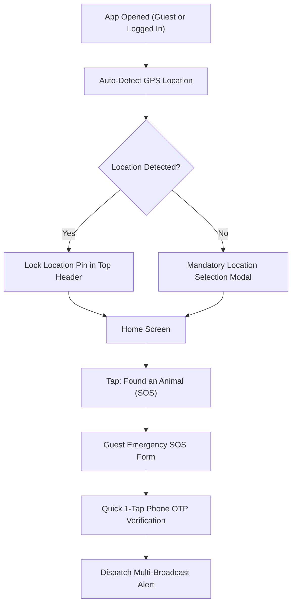

# Paw ResQ: Low-Fidelity Wireframes & User Flows (Phase 4)

## 1. Overview
This document specifies the structural wireframes, layout logic, and user flows for **Paw ResQ**, incorporating the mandatory location-first architecture, dual user perspectives (Bystander vs. Helper), Guest SOS emergency flow, clean bottom navigation bar, and detailed step-by-step page designs.

---

## 2. Non-Skippable Location & Guest SOS Flow


---

## 3. Clean Bottom Navigation Bar Schema

```
+-----------------------------------------------------------------------+
|  [ 🏠 Home ]    [ 🔍 Search ]    [ 🚨 Quick SOS ]    [ 💬 Chat ]    [ 👤 Profile ]  |
+-----------------------------------------------------------------------+
```

---

## 4. Home Screen Interface: Dual Perspective Layouts

### Perspective A: The Reporter / Bystander (Finding an Animal)

```
+-------------------------------------------------------------+
| [Profile / Sign In]   📍 Hitech City, Hyd   [🔔]  [🗺️ Map]  |
+-------------------------------------------------------------+
|                                                             |
|   +-----------------------------------------------------+   |
|   | 🚨 FOUND AN INJURED ANIMAL (HERO SOS CARD)          |   |
|   |    Tap for Immediate Location-Based Help            |   |
|   +-----------------------------------------------------+   |
|                                                             |
|   +--------------------------+  +-----------------------+   |
|   | 🛟 ACTIVE RESCUES        |  | 🩺 NEARBY VETS        |   |
|   |    Track ongoing cases   |  |    Emergency clinics  |   |
|   +--------------------------+  +-----------------------+   |
|                                                             |
|   +-----------------------------------------------------+   |
|   | 💡 First-Aid Card: Keep animal warm & quiet          |   |
|   +-----------------------------------------------------+   |
|                                                             |
+-------------------------------------------------------------+
| [🏠 Home]   [🔍 Search]   [🚨 SOS]   [💬 Chat]   [👤 Profile]|
+-------------------------------------------------------------+
```

---

## 5. Page 2: Emergency SOS Flow (Bystander vs. Helper Dual Perspective)

### Bystander Creation Flow (Strict Priority Order)
1. **Step 2.1: LOCATION (MANDATORY):** Auto GPS pin lock + Landmark note. Cannot be skipped.
2. **Step 2.2: CONDITION & HAZARD TAGS (MANDATORY):** Species, Severity badge, Hazard flags. Cannot be skipped.
3. **Step 2.3: RECIPIENT SELECTOR (MANDATORY):** Multi-select (Volunteers, NGOs, Vets, Transport). Cannot be skipped.
4. **Step 2.4: PHOTO UPLOAD (OPTIONAL / SECONDARY):** Upload photo or tap `[ SKIP & DISPATCH INSTANTLY ]`. Can add photo later while waiting for helper.

---

## 6. Page 3: Search & Directory Screen (`[ 🔍 Search ]` Tab)

```
+-------------------------------------------------------------+
| 🔍 [ Search Vets, NGOs, Rescuers...       ]   [⚙️ Filter]   |
+-------------------------------------------------------------+
| ( [All]  [🟢 Open 24/7]  [🩺 Vets]  [🏢 NGOs]  [🏠 Shelters] )|
+-------------------------------------------------------------+
| 📍 Results within 5 km of Hitech City        [🗺️ Map View] |
+-------------------------------------------------------------+
|                                                             |
|  +-------------------------------------------------------+  |
|  | 🩺 Dr. Sharma Emergency Pet Clinic   🟢 Open 24/7     |  |
|  |    Verified Vet ✓ | ★ 4.9 (140 reviews) | 1.2 km away |  |
|  |    [📞 Call Now]    [💬 Chat]    [⭐️ Write Review]     |  |
|  +-------------------------------------------------------+  |
|                                                             |
+-------------------------------------------------------------+
| [🏠 Home]   [🔍 Search]   [🚨 SOS]   [💬 Chat]   [👤 Profile]|
+-------------------------------------------------------------+
```

---

## 7. Page 4: In-App Chat & Communication Console (`[ 💬 Chat ]` Tab)

### Overview
Page 4 serves as the central communication hub. It features two modes:
1. **Emergency Active Rescue Console:** Real-time, action-assisted chat between Bystander and Accepted Helper during an active rescue.
2. **Direct Messages Inbox:** Conversations with clinics, NGOs, and volunteers for non-emergency inquiries.

---

### Layout: Active Emergency Rescue Chat Screen

```
+-------------------------------------------------------------+
| [←]  Rahul M. (Volunteer) 🟢 En Route (4 mins)  [📞 Call]   |
+-------------------------------------------------------------+
| 🤖 [System]: SOS Alert accepted by Rahul M.                 |
| 🤖 [System]: Live Location shared. ETA ~ 4 mins.           |
|                                                             |
| [Helper]: "I'm on my way on my bike. Please keep the dog  |
|           covered with a cloth if possible." (10:14 AM)     |
|                                                             |
| [Bystander]: "Okay, I have covered him. He is near the      |
|              banyan tree." (10:15 AM)                       |
|                                                             |
| +---------------------------------------------------------+ |
| | Quick Actions: [📸 Add Photo] [📍 Re-send Pin] [🤝 Arrived]| |
| +---------------------------------------------------------+ |
| | Type a message...                                | [▶]  | |
+-------------------------------------------------------------+
| [🏠 Home]   [🔍 Search]   [🚨 SOS]   [💬 Chat]   [👤 Profile]|
+-------------------------------------------------------------+
```

### Key Features of Page 4:
1. **Header Live Status:** Displays Helper name, Verified badge, live ETA ("En Route - 4 mins away"), and direct emergency call button.
2. **Automated System Timeline Logs:** Keeps a transparent audit trail of dispatch milestones (`Alert Accepted`, `Location Locked`, `Handoff Confirmed`).
3. **Emergency Quick Action Chips above Text Box:** 1-tap shortcuts for critical moments:
   - `[ 📸 Add Photo Later ]` (Uploads photo after initial report dispatch)
   - `[ 📍 Re-send Pin ]` (Updates location if animal moves)
   - `[ 🤝 Handoff Complete ]` (Triggers rescue completion & rating prompt)
4. **Post-Rescue Rating Modal:** Automatically pops up when `Handoff Complete` is pressed, allowing the bystander to rate the helper and leave a review.
