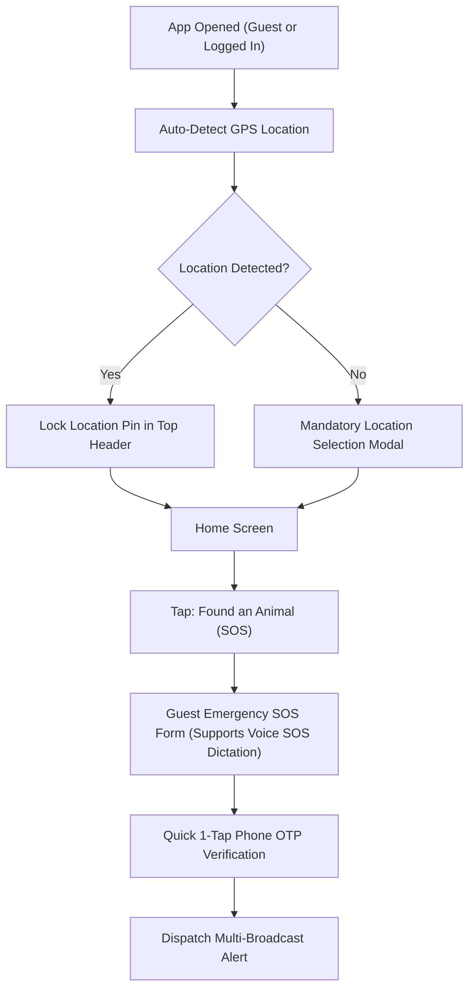

# Paw ResQ: Low-Fidelity Wireframes & User Flows (Phase 4)

## 1. Overview
This document specifies the structural wireframes, layout logic, and user flows for **Paw ResQ**, incorporating the mandatory location-first architecture, dual user perspectives (Bystander vs. Helper), Guest SOS emergency flow, clean bottom navigation bar, voice-command transcription engine, and detailed step-by-step page designs.

---

## 2. Non-Skippable Location & Guest SOS Flow


---

## 3. Clean Bottom Navigation Bar Schema

```
+-----------------------------------------------------------------------+
|  [ 🏠 Home ]    [ 🔍 Search ]    [ 🚨 Quick SOS ]    [ 💬 Chat ]    [ 👤 Profile ]  |
+-----------------------------------------------------------------------+
```

---

## 4. Home Screen Interface: Dual Perspective Layouts

### Perspective A: The Reporter / Bystander (Finding an Animal)

```
+-------------------------------------------------------------+
| [Profile / Sign In]   📍 Hitech City, Hyd   [🔔]  [🗺️ Map]  |
+-------------------------------------------------------------+
|                                                             |
|   +-----------------------------------------------------+   |
|   | 🚨 FOUND AN INJURED ANIMAL (HERO SOS CARD)          |   |
|   |    Tap for Immediate Location-Based Help            |   |
|   |    🎙️ [Hold to Speak Voice SOS]                     |   |
|   +-----------------------------------------------------+   |
|                                                             |
|   +--------------------------+  +-----------------------+   |
|   | 🛟 ACTIVE RESCUES        |  | 🩺 NEARBY VETS        |   |
|   |    Track ongoing cases   |  |    Emergency clinics  |   |
|   +--------------------------+  +-----------------------+   |
|                                                             |
|   +-----------------------------------------------------+   |
|   | 💡 First-Aid Card: Keep animal warm & quiet          |   |
|   +-----------------------------------------------------+   |
|                                                             |
+-------------------------------------------------------------+
| [🏠 Home]   [🔍 Search]   [🚨 SOS]   [💬 Chat]   [👤 Profile]|
+-------------------------------------------------------------+
```

---

## 5. Page 2: Emergency SOS Flow (With Voice Dictation Engine)

### Bystander Creation Flow
1. **Step 2.1: LOCATION (MANDATORY):** Auto GPS pin lock + Landmark note. Cannot be skipped.
2. **Step 2.2: CONDITION & HAZARD TAGS (MANDATORY):** Select tags OR **Hold Mic Button to Dictate** (e.g., *"Injured dog bleeding near banyan tree"* ➔ AI auto-selects `Dog` + `Bleeding` tags + transcribes text).
3. **Step 2.3: RECIPIENT SELECTOR (MANDATORY):** Multi-select (Volunteers, NGOs, Vets, Transport). Cannot be skipped.
4. **Step 2.4: PHOTO UPLOAD (OPTIONAL):** Upload photo or tap `[ SKIP & DISPATCH INSTANTLY ]`.

---

## 6. Page 3: Search & Directory Screen (`[ 🔍 Search ]` Tab)

```
+-------------------------------------------------------------+
| 🔍 [ Search Vets, NGOs, Rescuers...       ]   [⚙️ Filter]   |
+-------------------------------------------------------------+
| ( [All]  [🟢 Open 24/7]  [🩺 Vets]  [🏢 NGOs]  [🏠 Shelters] )|
+-------------------------------------------------------------+
| 📍 Results within 5 km of Hitech City        [🗺️ Map View] |
+-------------------------------------------------------------+
|                                                             |
|  +-------------------------------------------------------+  |
|  | 🩺 Dr. Sharma Emergency Pet Clinic   🟢 Open 24/7     |  |
|  |    Verified Vet ✓ | ★ 4.9 (140 reviews) | 1.2 km away |  |
|  |    [📞 Call Now]    [💬 Chat]    [⭐️ Write Review]     |  |
|  +-------------------------------------------------------+  |
|                                                             |
+-------------------------------------------------------------+
| [🏠 Home]   [🔍 Search]   [🚨 SOS]   [💬 Chat]   [👤 Profile]|
+-------------------------------------------------------------+
```

---

## 7. Page 4: In-App Chat & Communication Console (With Voice & Transcription)

```
+-------------------------------------------------------------+
| [←]  Rahul M. (Volunteer) 🟢 En Route (4 mins)  [📞 Call]   |
+-------------------------------------------------------------+
| 🤖 [System]: SOS Alert accepted by Rahul M.                 |
|                                                             |
| [Bystander - Voice Message]:                                |
| 🔊 ▶ [•••••••••••••••••] 0:12 sec                          |
| 📄 Transcribed Text: "He is moving towards the tea stall   |
|    near pillar 14, please hurry."                           |
|                                                             |
| [Helper]: "Got it, I am turning into the street now."       |
|                                                             |
| +---------------------------------------------------------+ |
| | Quick Actions: [📸 Add Photo] [📍 Re-send Pin] [🤝 Arrived]| |
| +---------------------------------------------------------+ |
| | Type a message...                        | 🎙️ | [▶]     | |
+-------------------------------------------------------------+
| [🏠 Home]   [🔍 Search]   [🚨 SOS]   [💬 Chat]   [👤 Profile]|
+-------------------------------------------------------------+
```

### Voice Command Architecture Details:
1. **Dual Voice Modes:**
   - **Mode A (Voice Note):** Sends playable audio waveform (`🔊 ▶ 0:12 sec`).
   - **Mode B (Live Speech-to-Text Transcription):** Converts spoken voice into text in real time, displaying both the playable audio AND text transcript in chat so helpers can read silently or listen while driving.
2. **Emergency Voice SOS Dictation:** On the SOS creation screen, holding the mic button auto-populates condition tags and landmark text notes automatically.
