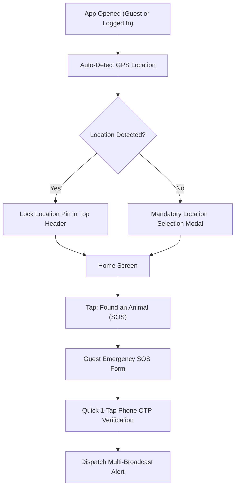

# Paw ResQ: Low-Fidelity Wireframes & User Flows (Phase 4)

## 1. Overview
This document specifies the structural wireframes, layout logic, and user flows for **Paw ResQ**, incorporating the mandatory location-first architecture, dual user perspectives (Bystander vs. Helper), Guest SOS emergency flow, clean bottom navigation bar, and detailed step-by-step page designs.

---

## 2. Non-Skippable Location & Guest SOS Flow


---

## 3. Clean Bottom Navigation Bar Schema

```
+-----------------------------------------------------------------------+
|  [ 🏠 Home ]    [ 🔍 Search ]    [ 🚨 Quick SOS ]    [ 💬 Chat ]    [ 👤 Profile ]  |
+-----------------------------------------------------------------------+
```

---

## 4. Home Screen Interface: Dual Perspective Layouts

### Perspective A: The Reporter / Bystander (Finding an Animal)

```
+-------------------------------------------------------------+
| [Profile / Sign In]   📍 Hitech City, Hyd   [🔔]  [🗺️ Map]  |
+-------------------------------------------------------------+
|                                                             |
|   +-----------------------------------------------------+   |
|   | 🚨 FOUND AN INJURED ANIMAL (HERO SOS CARD)          |   |
|   |    Tap for Immediate Location-Based Help            |   |
|   +-----------------------------------------------------+   |
|                                                             |
|   +--------------------------+  +-----------------------+   |
|   | 🛟 ACTIVE RESCUES        |  | 🩺 NEARBY VETS        |   |
|   |    Track ongoing cases   |  |    Emergency clinics  |   |
|   +--------------------------+  +-----------------------+   |
|                                                             |
|   +-----------------------------------------------------+   |
|   | 💡 First-Aid Card: Keep animal warm & quiet          |   |
|   +-----------------------------------------------------+   |
|                                                             |
+-------------------------------------------------------------+
| [🏠 Home]   [🔍 Search]   [🚨 SOS]   [💬 Chat]   [👤 Profile]|
+-------------------------------------------------------------+
```

---

## 5. Page 2: Emergency SOS Flow (Bystander vs. Helper Dual Perspective)

### Bystander Creation Flow (Strict Priority Order)
1. **Step 2.1: LOCATION (MANDATORY):** Auto GPS pin lock + Landmark note. Cannot be skipped.
2. **Step 2.2: CONDITION & HAZARD TAGS (MANDATORY):** Species, Severity badge, Hazard flags. Cannot be skipped.
3. **Step 2.3: RECIPIENT SELECTOR (MANDATORY):** Multi-select (Volunteers, NGOs, Vets, Transport). Cannot be skipped.
4. **Step 2.4: PHOTO UPLOAD (OPTIONAL / SECONDARY):** Upload photo or tap `[ SKIP & DISPATCH INSTANTLY ]`. Can add photo later while waiting for helper.

---

## 6. Page 3: Search & Directory Screen (`[ 🔍 Search ]` Tab)

### Overview & Purpose
Page 3 provides a fast, location-filtered directory connecting users with nearby verified care providers (Veterinarians, NGOs, Rescuers, Shelters, and Transport).

```
+-------------------------------------------------------------+
| 🔍 [ Search Vets, NGOs, Rescuers...       ]   [⚙️ Filter]   |
+-------------------------------------------------------------+
| ( [All]  [🩺 Vets]  [🏢 NGOs]  [🛟 Rescuers]  [🏠 Shelters] )|
+-------------------------------------------------------------+
| 📍 Results within 5 km of Hitech City        [🗺️ Map View] |
+-------------------------------------------------------------+
|                                                             |
|  +-------------------------------------------------------+  |
|  | 🩺 Dr. Sharma Emergency Pet Clinic   🟢 Open 24/7     |  |
|  |    Verified Vet ✓ | ★ 4.9 (140 reviews) | 1.2 km away |  |
|  |    [📞 Call Now]    [💬 Chat]    [📍 Directions]      |  |
|  +-------------------------------------------------------+  |
|                                                             |
|  +-------------------------------------------------------+  |
|  | 🏢 Compassion Animal NGO             🟡 Open till 8PM  |  |
|  |    Verified NGO ✓ | ★ 4.8 (95 rescues) | 2.4 km away   |  |
|  |    [📞 Call Now]    [💬 Chat]    [📍 Directions]      |  |
|  +-------------------------------------------------------+  |
|                                                             |
+-------------------------------------------------------------+
| [🏠 Home]   [🔍 Search]   [🚨 SOS]   [💬 Chat]   [👤 Profile]|
+-------------------------------------------------------------+
```

### Key Interactive Components of Page 3:
1. **Top Search Field & Filter Toggle:** Real-time search with filter drawer (`Filter by 24/7 Open`, `Distance Radius`, `Rating > 4.5`, `Verified Badges Only`).
2. **Horizontal Category Chips:** Quick 1-tap switching between provider categories.
3. **Map / List View Switcher:** Toggles between card listing and interactive Map Pins showing exact provider locations.
4. **Direct Action Buttons on Cards:** Every directory card features immediate action CTAs (`Call Now`, `Chat`, `Directions`).
